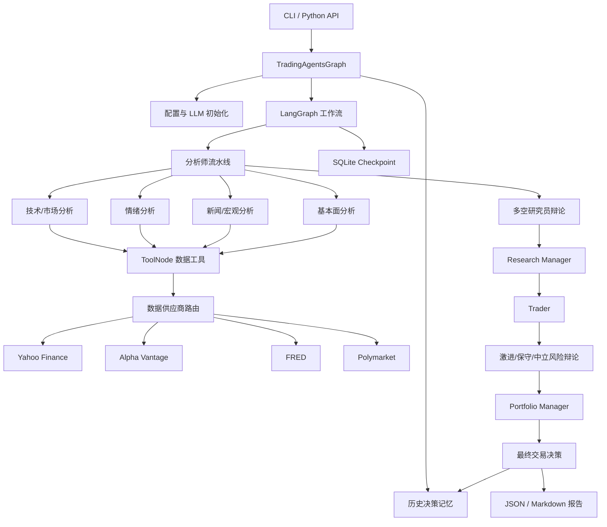

# TradingAgents 项目架构

## 1. 项目定位

TradingAgents 是一个基于 **LangGraph + LangChain** 的多智能体金融分析框架。项目模拟真实交易机构的协作流程，由多个专业 Agent 分别完成市场、情绪、新闻和基本面分析，再通过多空辩论、交易计划和风险审议，最终输出 Buy、Overweight、Hold、Underweight 或 Sell 等交易评级。

项目只负责研究分析和交易决策生成，目前没有对接真实券商的订单执行层。

## 2. 总体架构



核心业务链路为：

```text
数据分析
  → 多空研究辩论
  → 研究经理裁决
  → 交易员形成交易方案
  → 风险团队辩论
  → 投资组合经理生成最终决定
```

## 3. 目录结构与职责

```text
TradingAgents-main/
├── main.py                     Python API 调用示例
├── cli/                        交互式命令行程序
├── tradingagents/
│   ├── agents/                 各类智能体及其工具
│   ├── dataflows/              数据源实现与供应商路由
│   ├── graph/                  LangGraph 工作流编排
│   ├── llm_clients/            LLM 供应商适配层
│   ├── default_config.py       默认配置与环境变量覆盖
│   └── reporting.py            Markdown 报告输出
├── tests/                      自动化测试
├── scripts/                    冒烟测试等辅助脚本
├── assets/                     文档和 CLI 图片资源
├── pyproject.toml              包、依赖和工具配置
├── Dockerfile
└── docker-compose.yml
```

### 3.1 应用入口

- `main.py`：展示最简单的程序化调用方式。
- `cli/main.py`：交互式 CLI 主程序。
- `cli/utils.py`：处理 ticker、模型、供应商、API Key 和研究深度等交互选择。
- `cli/stats_handler.py`：统计 LLM 与工具调用情况。
- `pyproject.toml`：将 `cli.main:app` 注册为 `tradingagents` 命令。

程序化调用的核心形式如下：

```python
from tradingagents.graph.trading_graph import TradingAgentsGraph

ta = TradingAgentsGraph(config=config)
state, decision = ta.propagate("NVDA", "2026-01-15")
```

CLI 最终也会构造并调用 `TradingAgentsGraph`，因此 CLI 与 Python API 共用同一套业务逻辑。

## 4. 图编排层

图编排代码位于 `tradingagents/graph/`。

| 文件 | 职责 |
|---|---|
| `trading_graph.py` | 系统总控制器，负责初始化、执行、日志、记忆和结果处理 |
| `setup.py` | 注册 LangGraph 节点、普通边和条件边 |
| `conditional_logic.py` | 决定工具调用、辩论轮次和下一个发言者 |
| `propagation.py` | 创建初始状态和图执行参数 |
| `analyst_execution.py` | 根据选项构建分析师执行计划 |
| `checkpointer.py` | 使用 SQLite 保存和恢复 LangGraph 状态 |
| `reflection.py` | 根据实际收益对历史交易决定进行反思 |
| `signal_processing.py` | 从最终长文本中提取标准化交易评级 |

### 4.1 TradingAgentsGraph

`TradingAgentsGraph` 是项目的 Facade 和主要编排对象。初始化过程包括：

1. 加载并注册数据源配置。
2. 创建快速思考模型和深度思考模型。
3. 初始化历史决策日志。
4. 为四类分析师创建 ToolNode。
5. 创建条件路由与 Agent 节点。
6. 构建并编译 LangGraph。
7. 根据配置决定是否启用 SQLite checkpoint。

调用 `propagate()` 后，系统会：

1. 解析历史待复盘决策。
2. 解析证券真实身份和资产类型。
3. 创建统一的 `AgentState`。
4. 执行或恢复 LangGraph 工作流。
5. 保存完整状态日志。
6. 记录最终交易决定。
7. 清理已成功完成的 checkpoint。
8. 从最终文本提取核心交易信号。

## 5. LangGraph 执行流程

### 5.1 分析师阶段

默认分析师按以下顺序执行：

```text
Market Analyst
  → Sentiment Analyst
  → News Analyst
  → Fundamentals Analyst
```

每个分析师都遵循相同的工具调用循环：

```text
分析师调用 LLM
  ├─ LLM 返回 tool_calls → ToolNode 执行工具 → 回到当前分析师
  └─ LLM 不再调用工具 → 清理 messages → 进入下一名分析师
```

四类分析结果分别写入：

- `market_report`
- `sentiment_report`
- `news_report`
- `fundamentals_report`

这些分析师在业务上彼此相对独立，但当前主图中采用顺序执行方式。

### 5.2 多空研究阶段

分析师阶段结束后进入：

```text
Bull Researcher ⇄ Bear Researcher
                  ↓
           Research Manager
```

多头与空头研究员轮流发言，辩论次数由 `max_debate_rounds` 控制。达到指定轮次后，Research Manager 综合双方观点，生成 `investment_plan`。

### 5.3 交易与风险阶段

研究经理裁决后进入：

```text
Trader
  → Aggressive Analyst
  → Conservative Analyst
  → Neutral Analyst
  → Portfolio Manager
```

Trader 根据分析报告和研究结论形成交易方案。三类风险 Agent 从不同风险偏好出发循环讨论，轮次由 `max_risk_discuss_rounds` 控制。

Portfolio Manager 最终综合：

- Research Manager 的投资计划；
- Trader 的交易方案；
- 风险团队辩论记录；
- 历史交易决策及反思；

生成 `final_trade_decision`。

## 6. 状态模型

共享状态定义在 `tradingagents/agents/utils/agent_states.py`。核心状态 `AgentState` 继承自 LangGraph 的 `MessagesState`。

### 6.1 标的信息

```text
company_of_interest
asset_type
instrument_context
trade_date
```

`instrument_context` 在运行开始时通过确定性数据查询解析证券身份，并注入所有 Agent，减少模型仅凭 ticker 猜测公司名称或资产类型的风险。

### 6.2 分析师报告

```text
market_report
sentiment_report
news_report
fundamentals_report
```

### 6.3 多空研究状态

```text
investment_debate_state
investment_plan
trader_investment_plan
```

`investment_debate_state` 保存多头和空头的历史发言、当前回答、辩论次数和 Research Manager 的裁决。

### 6.4 风险和最终决策

```text
risk_debate_state
final_trade_decision
past_context
```

`risk_debate_state` 保存激进、保守和中立风险 Agent 的发言及 Portfolio Manager 裁决。`past_context` 保存历史决策和复盘经验。

## 7. Agent 层

Agent 位于 `tradingagents/agents/`：

```text
agents/
├── analysts/       市场、情绪、新闻、基本面分析师
├── researchers/    多头和空头研究员
├── trader/         交易员
├── risk_mgmt/      激进、中立和保守风险分析师
├── managers/       Research Manager、Portfolio Manager
├── utils/          工具、状态、记忆、评级和结构化输出
└── schemas.py      结构化决策模型
```

Agent 普遍采用工厂函数返回 LangGraph 节点函数的形式：

```python
def create_market_analyst(llm):
    def market_analyst_node(state):
        # 读取状态、构建 Prompt、调用模型并返回状态增量
        ...
    return market_analyst_node
```

Agent 不保存独立的可变运行状态，而是从共享 `state` 读取输入，并返回需要合并的状态增量。

Research Manager、Trader 和 Portfolio Manager 支持结构化输出。当模型或供应商不支持结构化输出时，系统会退回自由文本生成模式。

## 8. 数据访问层

数据访问分为 Agent 工具层和数据供应商层。

### 8.1 Agent 工具层

工具位于 `tradingagents/agents/utils/`，包括：

- `core_stock_tools.py`
- `technical_indicators_tools.py`
- `fundamental_data_tools.py`
- `news_data_tools.py`
- `macro_data_tools.py`
- `prediction_markets_tools.py`
- `market_data_validation_tools.py`

这些函数以 LangChain Tool 的形式暴露给 LLM。Agent 依赖 `get_stock_data`、`get_news` 等抽象接口，而不直接依赖具体数据供应商。

### 8.2 数据源实现与路由

数据实现位于 `tradingagents/dataflows/`，核心路由在 `interface.py`。

| 数据类别 | 主要工具 | 数据源 |
|---|---|---|
| 行情 | `get_stock_data` | Yahoo Finance、Alpha Vantage |
| 技术指标 | `get_indicators` | Yahoo Finance、Alpha Vantage |
| 基本面 | 财报、现金流、资产负债表 | Yahoo Finance、Alpha Vantage |
| 新闻 | 个股新闻、全球新闻、内部人交易 | Yahoo Finance、Alpha Vantage |
| 宏观 | `get_macro_indicators` | FRED |
| 预测市场 | `get_prediction_markets` | Polymarket |

供应商配置支持类别级和工具级覆盖。工具级配置优先于类别级配置。

系统不会自动使用用户未选择的数据源。如果需要多供应商回退，必须显式声明顺序，例如：

```python
"core_stock_apis": "yfinance,alpha_vantage"
```

数据路由层将失败分成三类：

- 核心数据失败：通常向上抛出异常，避免在缺少关键数据时继续生成结论。
- 可选增强数据失败：宏观或预测市场不可用时返回明确的降级标记。
- 无市场数据：返回 `NO_DATA_AVAILABLE`，明确要求 Agent 不得估算或编造。

## 9. LLM 适配层

LLM 适配代码位于 `tradingagents/llm_clients/`，统一入口为：

```python
create_llm_client(provider, model, base_url, **kwargs)
```

供应商分为两类：

- 原生协议：Anthropic、Google、Azure OpenAI、AWS Bedrock。
- OpenAI 兼容协议：OpenAI、DeepSeek、Qwen、GLM、MiniMax、OpenRouter、Ollama、vLLM、LM Studio 等。

系统创建两个模型实例：

```text
quick_thinking_llm
deep_thinking_llm
```

快速模型主要用于：

- 四类分析师；
- 多空研究员；
- Trader；
- 风险辩论；
- 信号解析和历史反思。

深度模型主要用于：

- Research Manager；
- Portfolio Manager。

这种设计用于平衡调用成本、响应延迟和关键决策质量。

## 10. 配置体系

默认配置位于 `tradingagents/default_config.py`，主要包括：

- LLM 供应商和模型；
- reasoning/thinking 参数；
- temperature 和 retry；
- 分析师辩论轮数；
- 风险讨论轮数；
- 输出语言；
- 数据供应商；
- 新闻数量和回看窗口；
- 市场基准；
- 缓存、日志和记忆路径；
- checkpoint 开关。

配置来源和覆盖关系大致为：

```text
默认配置
  → TRADINGAGENTS_* 环境变量
  → CLI 交互选择或调用方显式覆盖
```

环境变量会根据默认值类型进行转换。非法布尔值或数字会在启动阶段直接报错，避免静默误配置。

## 11. 持久化机制

### 11.1 完整状态日志

每次成功执行后，完整状态默认保存在：

```text
~/.tradingagents/logs/<ticker>/TradingAgentsStrategy_logs/
    full_states_log_<date>.json
```

日志包含分析报告、辩论历史、投资计划、交易方案、风险讨论和最终决定。

### 11.2 Markdown 报告

`reporting.py` 负责将最终状态整理为适合阅读的 Markdown 报告目录。Python API 可通过 `save_reports()` 输出与 CLI 类似的报告结构。

### 11.3 决策记忆与反思

`tradingagents/agents/utils/memory.py` 维护追加式 Markdown 决策日志：

```text
~/.tradingagents/memory/trading_memory.md
```

运行结束后，系统先记录一条待复盘决策。下一次分析相同 ticker 时：

1. 查询决策后的实际收益。
2. 计算原始收益及相对市场基准的超额收益。
3. 调用 LLM 生成历史决策反思。
4. 更新历史日志。
5. 将近期同标的决策和跨标的经验注入新一轮分析。

这是轻量级跨运行记忆，不属于模型训练或向量数据库检索。

### 11.4 Checkpoint 恢复

启用 `checkpoint_enabled` 后，项目使用 LangGraph SQLite Saver 保存节点级运行状态。

Checkpoint 标识包含：

- ticker；
- 交易日期；
- 分析师组合；
- 多空辩论深度；
- 风险讨论深度；
- 资产类型。

修改图结构相关配置后不会错误续跑旧状态。工作流成功结束后，对应 checkpoint 会自动清理。

## 12. 输出结果

`TradingAgentsGraph.propagate()` 返回：

```python
final_state, decision = ta.propagate(ticker, trade_date)
```

- `final_state`：包含所有中间报告、辩论历史和最终决定的完整状态。
- `decision`：从 `final_trade_decision` 中解析出的标准化核心交易信号。

Portfolio Manager 使用五级评级体系：

- Buy
- Overweight
- Hold
- Underweight
- Sell

## 13. 测试与工程化

`tests/` 已覆盖项目的多数关键边界，包括：

- 数据供应商路由和错误回退；
- ticker 规范化与路径安全；
- 历史日期和新闻前视偏差；
- checkpoint 恢复；
- LLM 供应商和模型参数；
- 结构化输出；
- 加密资产模式；
- FRED、Polymarket、StockTwits；
- 市场数据陈旧检查；
- 信号解析；
- 环境变量配置覆盖。

工程化支持还包括：

- Dockerfile 和 Docker Compose；
- Ruff 静态检查；
- Pytest marker；
- Bedrock 可选依赖；
- Python package 和 CLI entry point。

## 14. 架构特点与改进方向

### 14.1 主要优点

- Agent 与具体数据供应商解耦。
- LLM 供应商通过统一工厂适配。
- LangGraph 状态和条件路由结构清晰。
- 对无数据、陈旧数据、前视偏差和 ticker 路径安全做了较多防护。
- 支持 checkpoint、决策日志和事后收益反思。
- 关键管理节点支持结构化输出，提高最终结果稳定性。
- CLI 与 Python API 复用同一核心执行链路。

### 14.2 潜在改进点

- 四类分析师当前顺序执行，整体调用延迟会累积，可评估并行化。
- `TradingAgentsGraph` 同时承担初始化、执行、收益查询、日志和记忆协调，职责偏重，可进一步拆分服务。
- 数据配置通过进程级全局状态 `set_config()` 注入，多实例并发运行时需要谨慎。
- Markdown 记忆日志随数据量增长后，解析和原子更新成本会上升，可迁移到 SQLite 或结构化存储。
- Agent Prompt 直接嵌在 Python 文件中，后续版本管理、多语言和 Prompt 测试成本较高。
- 目前没有真实交易执行层，如果未来接入券商，需要单独设计权限、风控、幂等、审计和订单状态机。

## 15. 分层总结

项目的主要依赖方向可以总结为：

```text
CLI / Python API
        ↓
TradingAgentsGraph 与 LangGraph 编排
        ↓
Agent 业务节点
        ↓
LangChain Tool 抽象
        ↓
数据供应商路由
        ↓
Yahoo Finance / Alpha Vantage / FRED / Polymarket
```

LLM 适配层、配置层、持久化和报告层作为横向基础设施，为整个工作流提供模型调用、运行恢复、长期记忆和结果输出能力。
